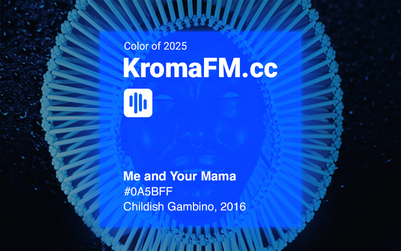
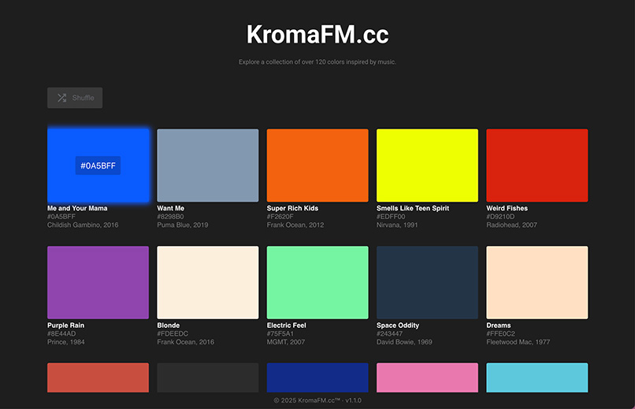

# KromaFM.cc v1.1 - Where Color Meets Music

<strong>KromaFM.cc</strong> is a personal project I built to learn React, JavaScript, and Vite. It’s a color palette where each swatch is linked to a song title. The first version uses a custom data array, and I’m currently working on integrating the Spotify API. The site is built with HTML, CSS, JavaScript, and React on a Vite setup. I kept the design minimal and focused on making it clean, functional, and easy to use. This project is part of my learning process and a way to show what I’ve been working on as I build my front-end development skills.

## Features:

### A Discovery Experience: 
Curated Song Pairings: Each color is thoughtfully selected to correspond with a specific song. Inspired by synesthesia—the natural blending of color and sound—each palette entry creates a memorable, meaningful connection between hue and music.

### Copy & Share Links: 
Users can copy any swatch’s hex code or generate a short URL for a color–song pairing. This makes it simple to include KromaFM entries in design inspiration boards or share favorite combinations with friends.

### User-Friendly Design:
KromaFM.cc features a minimalist, responsive layout that keeps the vibrant color swatches front and center. Clean typography and ample whitespace ensure easy readability, while a sticky header provides quick navigation. Whether on desktop or mobile, the interface stays uncluttered and intuitive.

### Lights On / Lights Off
A new dark theme option creates a more immersive, cinematic browsing experience. Ideal for nighttime sessions or low-light environments. The toggle is built directly into the sidebar, allowing users to switch themes instantly without reloading the page. Dark Mode applies globally across all views and adapts seamlessly to the app’s layout.

### Swatch Glow Effects (Dark mode only):
When using Dark Mode, color swatches now emit a soft glow on hover that matches their exact hue. This subtle lighting effect adds depth and interactivity.

## Tech Stack:
Front-end web app built with HTML5, CSS3, and modern JavaScript. It uses React for a modular, component-based structure and efficient rendering. Development is powered by Vite, enabling fast load times and instant updates during coding. All color and song data are handled in JSON or React state, with no backend server required—the app runs entirely in the browser.

## Installation & Running:

1. Clone the GitHub repo:
git clone https://github.com/YourUsername/KromaFM.cc.git  
2. Install dependencies: npm install (Vite, React, etc.)  
3. Run the development server: npm run dev.  
4. Open http://localhost:5173/ in your browser to see the app live.

## 🤝 Contributing:
KromaFM.cc is an open-source passion project — contributions from designers, developers, and music lovers are all welcome!

### Feel free to:

#### - Fork the repo and explore the code

#### - Suggest or remix color-song pairings

#### - Propose UI or UX improvements

## License & Brand:
This project’s source code is licensed under the [MIT License](./LICENSE).

**KromaFM.cc™** is an original trademark. The name, logo, and brand identity are the intellectual property of the creator and may not be used without explicit permission.

## 🚀 Planned Features

KromaFM.cc is just getting started. Here are some additions I'd like to add next:

- 🔍 **Search Bar** — Quickly find swatches by color name, song title, or artist
- 🎵 **Spotify Integration** — Preview songs and link directly to Spotify from each swatch

Have ideas? Let me know — I’d love to grow this with community input.

##

**Andre Mikel**  
Email: andremikel.dev@gmail.com  
GitHub: [@UglyMice](https://github.com/UglyMice)
